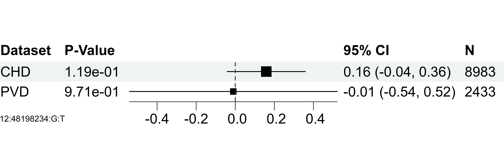

# senlinplot


The goal of senlinplot is to make forest plost from multiple GWAS summary statistics files.

## Installation

You can install the development version of senlinplot like so:

``` r
# Install devtools if it is not yet installed
if(!require("devtools")){
  installed.packages("devtools")
}

# Install senlinplot
if(!require("senlinplot")){
  devtools::install_github("Broccolito/senlinplot")
  library(senlinplot)
}
```

## Example

This is a basic example which shows you how to Plot a forest plot for SNP 12:48198234:G:T, given file **ACCORD_Axiom_EA_CHD_chr_merged_with_chrX.txt**, **ACCORD_Omni_EA_CHD_chr_merged_with_chrX.txt**, and **ARIC_EA_CHD_SAIGE_merged_auto_with_chrX.txt**.

``` r
library(senlinplot)

plot_forestplot_from_file(
  snp_name = "11:77367542:C:T",
  filelist = c("ACCORD_Axiom_EA_CHD_chr_merged_with_chrX.txt",
               "ACCORD_Omni_EA_CHD_chr_merged_with_chrX.txt",
               "ARIC_EA_CHD_SAIGE_merged_auto_with_chrX.txt"),
  dataset_list = c("Axiom", "Omni", "ARIC"),
  identifier_column_name = "SNPID",
  effectsize_column_name = "BETA",
  stderr_column_name = "SE",
  pvalue_column_name = "p.value",
  samplesize_column_name = "N",
  check_inverse_ref = TRUE,
  device = "pdf"
)
```

Here is an example figure generated using senlinplot:



Alternatively, the data.frame used by the plot_forestplot_from_file can be obtained separately and further edited using:

```R
d = get_all_stats(
  snp_name = "11:77367542:T:C",
  filelist = c("ACCORD_Axiom_EA_CHD_chr_merged_with_chrX.txt",
               "ACCORD_Omni_EA_CHD_chr_merged_with_chrX.txt",
               "ARIC_EA_CHD_SAIGE_merged_auto_with_chrX.txt"),
  dataset_list = c("Axiom", "Omni", "ARIC"),
  identifier_column_name = "SNPID",
  effectsize_column_name = "BETA",
  stderr_column_name = "SE",
  pvalue_column_name = "p.value",
  samplesize_column_name = "N",
  check_inverse_ref = TRUE
)
```

The data.frame generated will look like:

| marker          | dataset |     effect |        se | pvalue   | ci                  |  c95_lower | c95_upper |    n |
| :-------------- | :------ | ---------: | --------: | :------- | :------------------ | ---------: | --------: | ---: |
| 11:77367542:C:T | ARIC    |  0.1011594 | 0.2367094 | 6.69e-01 | 0.1 (-0.36, 0.57)   | -0.3627911 | 0.5651099 |  272 |
| 11:77367542:C:T | Axiom   | -0.0678240 | 0.0560442 | 2.26e-01 | -0.07 (-0.18, 0.04) | -0.1776705 | 0.0420226 | 4082 |
| 11:77367542:C:T | Omni    | -0.0892846 | 0.0928913 | 3.36e-01 | -0.09 (-0.27, 0.09) | -0.2713515 | 0.0927823 | 1762 |

Rows can be added or deleted to customize the look of the forest plot.
