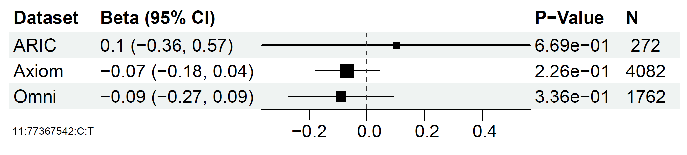

# senlinplot


The goal of senlinplot is to make forest plost from multiple GWAS summary statistics files.

## Installation

You can install the development version of senlinplot like so:

``` r
if(!require("senlinplot")){
  devtools::install_github("Broccolito/senlinplot")
  library(senlinplot)
}
```

## Example

This is a basic example which shows you how to Plot a forest plot for SNP 12:48198234:G:T, given file **CHD_TE_SUMSTAT_META_0110221.txt** and PVD_TE_META_X_0111221.txt

``` r
library(senlinplot)

plot_forestplot_from_file(
  snp_name = "12:48198234:G:T",
  filelist = c(
    "CHD_TE_SUMSTAT_META_0110221.txt",
    "PVD_TE_META_X_0111221.txt"
  ),
  dataset_list = c(
    "CHD",
    "PVD"
  ),
  identifier_column_name = "MarkerName",
  effectsize_column_name = "Effect",
  stderr_column_name = "StdErr",
  pvalue_column_name = "P-value",
  samplesize_column_name = "N"
)
```

Here is an example figure generated using senlinplot:



